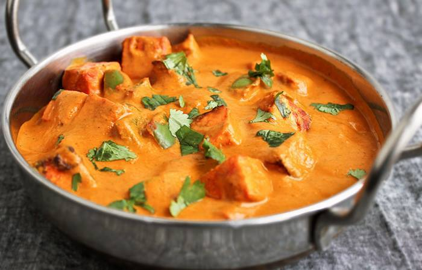

[^1]

### Table of Content

 --- 
- [About the recipe](#about-the-recipe)
- [Ingredients required for preparation](#ingredients-required-for-preparation)
- [Preparation of Paneer Butter Masala](#preparation-of-paneer-butter-masala)
 	- [Pre-requisites](#pre-requisites)
	- [Step by Step instructions](#step-by-step-instructions)
- [Tips for best results](#tips-for-best-results) 
- [Nutritian Value](#nutririan-value)
 ---

### About the recipe:
Paneer Butter Masala is one of the most popular Indian curry made of Paneer (cottage cheese) or tofu which has a slight tinge of sweetness along with its creamy texture.
 

> **Note:** This recipe takes about *35 minutes* for preparation and below mentioned quantity is enough for 3 servings.

---

### Ingredients required for preparation:

 **Items** | **Quantity**
 --- | --- 
 Paneer | 250 grams 
 Tomato | 5 (medium sized) 
 Onion | 2 (medium sized) 
 Garlic cloves | 8 - 10 number 
 Ginger | 1 inch size 
 Cashews | 15 - 20 number 
 Butter | 3 tablespoon 
 Cooking oil | 2 tablespoon 
 Chilli Powder | 1 tablespoon 
 Salt | as per taste 
 Corriander | finely chopped to garnish 
 
### Preparation of Paneer Butter Masala:

Below are the prelimenary steps to be taken before starting the preparation:

#### Pre-requisites:
- 	Soak cashews in lukewarm water for *20 minutes* before starting the recipe.
-	Chop 250 grams paneer into bite size cubes.
-	Peel ginger skin and finely chop it along with garlic cloves.
-	Coarsely slice Onion and coarsely chop Tomato to cook and blend.

#### Step by Step instructions:
1.	Heat 2 tablespoon Oil in a pan over medium flame and add finely chopped Garlic and Ginger. Sauté for a minute until the raw flavour disappears.
2.	Add coarsely sliced Onion, chopped Tomatoes, soaked Cashews to the same pan and sauté occasionally until Tomatoes softens and cover the pan for about *5 minutes*. 
3.	After 5 minutes, remove the pan out of heat and let it cool down to room temperature followed by blending the mixture into a smooth paste.
4.	Melt 3 tablespoon Butter in the same pan and add 1 tablespoon chilli powder. 
5.	Add the smooth paste to the pan, add salt to taste and stir the gravy for a minute.
6.	Cover the pan with a lid for about *10 minutes*.
7.	After 10 minutes remove the lid, add chopped  paneer and cook for about a minute. 
8.	Remove the curry from heat and garnish with freshly chopped corriander. 
9.	Delicious Paneer Butter Masala is ready to be served.

### Tips for best results:

- Tomato is one of the key ingredient of the dish, so ensure to use red, ripe and firm tomatoes.
- We can always use fresh store-bought paneer, but, for best flavour and taste it is recommended to use homemade paneer. You can refer [this](https://www.youtube.com/watch?v=A9bwHBikW8o) as reference[^2].
- Paneer cubes can be fried and added to thr gravy for extra crispness. 
- It is recommended to use kashmiri chilli powder or bright orangish-red colour, apart from this ripe red tomatoes also contribute towards lovely orangish-red coloured gravy.
- Due to shortage of time if Cashews cannot be pre-soaked for 30 minutes, we can replace it with finely grind Cashews in powdered consistency.

### Nutritian Value:

Below is an approximate estimate of the nutritional value. This dish contains a total of ==465kcal== for 1 serving.

--- | ---
Carbohydrates | *12g*
Protein | *14.6g*
Fat | *40.3g*
Saturated Fat | *11g*
Cholesterol | *48mg*
Sodium | *859mg*
Potassium | *296mg*
Fiber | *2.3g*
Sugar | *3.7g*
Calcium | *30mg*
Iron | *1.1mg*

[^1]: Image source - Google.
[^2]: Homamade paneer preparation video courtesy - Hebbars Kitchen

	
